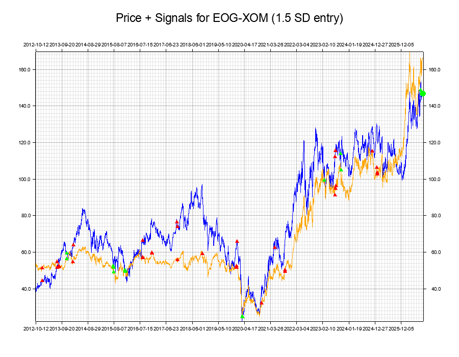
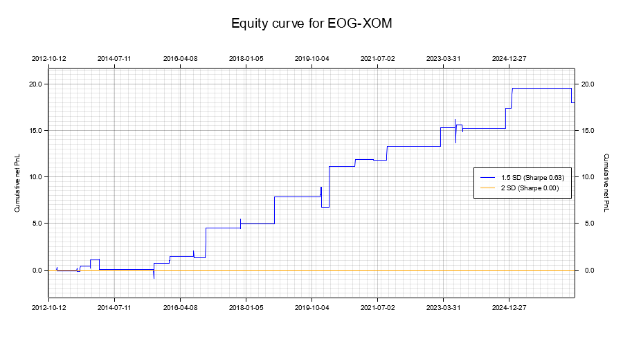
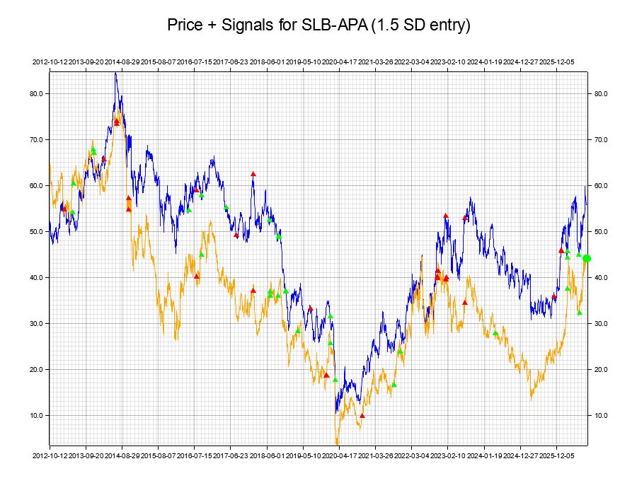
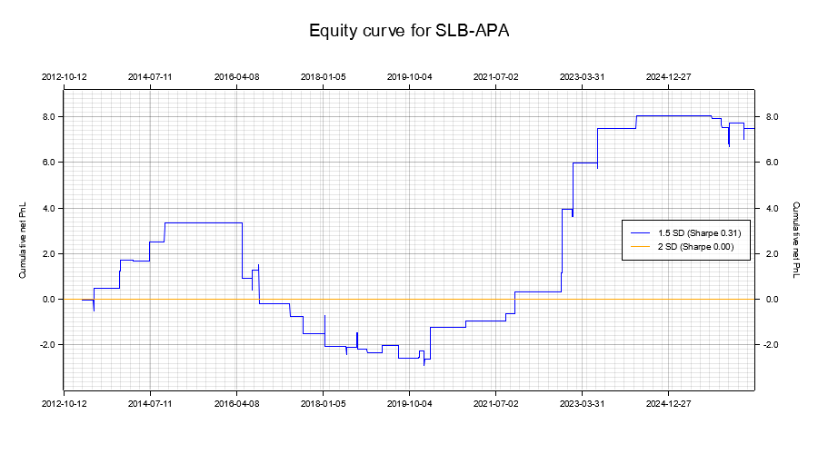
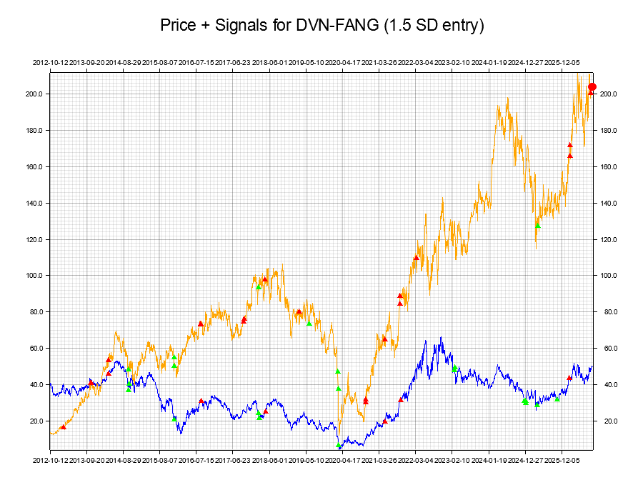
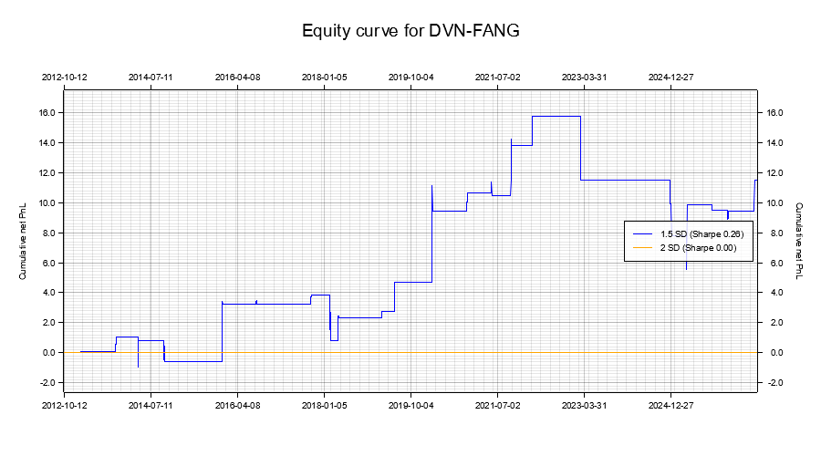

# statarbrust

A Rust statistical-arbitrage pairs-trading engine for the energy sector. Fetches historical prices, finds cointegrated pairs, generates mean-reversion trading signals, backtests them, and produces an HTML dashboard of the results.

## Pipeline

1. **Universe** — 15 energy tickers (`src/universe/energy_list.rs`), fetched from Yahoo Finance.
2. **Cointegration scan** — every pair is tested with Engle-Granger + ADF (MacKinnon critical values); only cointegrated pairs move forward.
3. **Spread & z-score** — OLS hedge ratio and spread per pair, then a rolling z-score: a 10-day short moving average of the spread relative to a 40-day long moving average, divided by the spread's own standard deviation over that same **40-day lookback**. So **1 SD = 1 standard deviation of the spread over the trailing 40 bars**, recomputed at every bar (not a fixed dollar amount, and not the strategy's PnL volatility — see Assumptions below).
4. **Signals** — mean-reversion entries at **1.5 SD** and **2.0 SD** (each backtested independently, so aggressive vs. conservative entries can be compared), exiting at 0.5 SD.
5. **Backtest** — per-bar PnL net of transaction costs (2 bps/leg per position change), producing an equity curve, annualized volatility, a risk-free-adjusted Sharpe ratio, and max drawdown for every pair/threshold combination.
6. **Ranking** — all pairs are ranked best-to-trade by Sharpe ratio.
7. **Forecast** — a short ARMA(1,2)-based 5-day-ahead spread forecast with projected trade direction.

## Output (`output/`)

- `dashboard.html` — ranking table + price/signal charts (both thresholds) and equity curves for every pair.
- `backtests_energy.csv` — rank, pair, threshold, gross PnL, transaction cost, net PnL, risk-free rate, volatility, Sharpe, max drawdown, trade count.
- Per-pair PNGs: `<A>_<B>_{1_5sd,2sd}_{signals,prices}.png`, `<A>_<B>_equity.png`.

## Running

```bash
cargo run --release
```

Requires network access to fetch price data from Yahoo Finance. Output is written to `output/`.

## Streamlit dashboard

An interactive alternative to `output/dashboard.html`: sortable/filterable ranking table, KPI cards, CSV download, and each pair's charts grouped side by side in a collapsible row (best pair first, expanded by default for the top 3).

```bash
pip install -r dashboard/requirements.txt
streamlit run dashboard/streamlit_app.py
```

It reads directly from `output/` (run `cargo run --release` first), or use the **Regenerate data** button in the sidebar to re-run the Rust pipeline from within the app (requires `cargo` on PATH and network access).

## Results (snapshot)

Yahoo Finance data is live, so results shift run to run — this table is from one run on 2026-09-11, included for reference. Full ranking in `output/backtests_energy.csv`.

| Rank | Pair | Entry SD | Risk-Free Rate | Volatility | Sharpe | Max Drawdown | Transaction Cost | Net PnL | Trades |
|---|---|---|---|---|---|---|---|---|---|
| 1 | EOG / XOM | 1.5 | 4.00% | 2.0702 | 0.607 | 2.5469 | 0.04 | 17.99 | 48 |
| 2 | SLB / APA | 1.5 | 4.00% | 1.6044 | 0.312 | 6.2415 | 0.04 | 7.50 | 54 |
| 3 | DVN / FANG | 1.5 | 4.00% | 3.0500 | 0.258 | 10.1833 | 0.04 | 11.48 | 47 |
| 4 | COP / FANG | 1.5 | 4.00% | 2.3203 | 0.181 | 4.2960 | 0.04 | 6.37 | 54 |
| 5 | EOG / FANG | 1.5 | 4.00% | 2.6668 | 0.178 | 7.4005 | 0.04 | 7.12 | 48 |
| 6 | HAL / APA | 1.5 | 4.00% | 1.2287 | 0.091 | 2.9024 | 0.05 | 2.10 | 59 |
| 7 | XOM / FANG | 1.5 | 4.00% | 1.5372 | 0.088 | 4.1831 | 0.03 | 2.43 | 36 |
| 8–19 | (all 2.0 SD pairs) | 2.0 | 4.00% | 0.0000 | 0.000 | 0.0000 | 0.00 | 0.00 | 0 |
| 20 | CVX / FANG | 1.5 | 4.00% | 4.1806 | -0.048 | 18.8278 | 0.05 | -2.20 | 59 |
| 21 | CVX / MPC | 1.5 | 4.00% | 4.3308 | -0.119 | 19.8911 | 0.04 | -6.58 | 48 |
| 22 | MPC / PSX | 1.5 | 4.00% | 2.0801 | -0.177 | 8.8869 | 0.04 | -4.55 | 47 |
| 23 | PSX / VLO | 1.5 | 4.00% | 2.5979 | -0.243 | 11.9832 | 0.04 | -8.21 | 46 |
| 24 | SLB / HAL | 1.5 | 4.00% | 1.0698 | -0.610 | 9.4672 | 0.05 | -8.49 | 58 |

Every 2.0 SD pair shows zero trades: with this z-score's 10/40-day window, the spread rarely swings past 2 SD, so the conservative threshold never fires. It's a real (if underwhelming) finding, not a bug — see Limitations below.

### Top 3 pairs

**#1 EOG / XOM** (Sharpe 0.607)




**#2 SLB / APA** (Sharpe 0.312)




**#3 DVN / FANG** (Sharpe 0.258)




## Layout

```
src/
  data/      price fetching (Yahoo Finance)
  model/     OLS, ADF/cointegration, spread & z-score, forecasting
  engine/    signal generation, backtesting
  universe/  ticker universe, correlation/cointegration scan, plotting, HTML export
dashboard/   Streamlit app that reads output/ and renders it interactively
```

## Assumptions & limitations

- **Sizing**: backtests use unit notional (1.0) per pair, so PnL/Sharpe/volatility figures are in normalized units, not dollars — useful for ranking pairs against each other, not as a real P&L.
- **Volatility lookback (results table)**: the `Volatility` and `Sharpe` columns are computed from bar-over-bar equity-curve changes over the *entire* backtest history (full sample, no rolling window), then annualized by √252 (`src/engine/backtest.rs`). This is a different lookback from the signal's own volatility estimate above (the z-score's rolling 40-day spread standard deviation) — the two "volatility" concepts in this project measure different things over different windows, so don't conflate a pair's full-sample Sharpe volatility with the 1 SD used to trigger its entries.
- **Costs**: 2 bps per leg charged on every position change (entry, exit, or a direct long↔short flip); no market impact or partial fills modeled.
- **Risk-free rate**: fixed at 4%/year (`RISK_FREE_RATE_ANNUAL` in `src/engine/backtest.rs`), applied per-bar against unit-notional returns — an approximation, not a real cash rate.
- **Hedge ratio look-ahead bias**: the OLS hedge ratio (`hedge_ratio_ols`) is fit once on the *entire* price series per pair, so early trades in the backtest technically use a hedge ratio informed by the full history, including data that hadn't happened yet. A walk-forward alternative (`walk_forward_hedge_ratio` in `src/model/spread.rs`) already exists in the codebase and fixes this, but main.rs doesn't use it yet — worth wiring in before treating results as realistic.
- **Not investment advice**: this is a research/education tool; do not trade on its output without independent validation.
