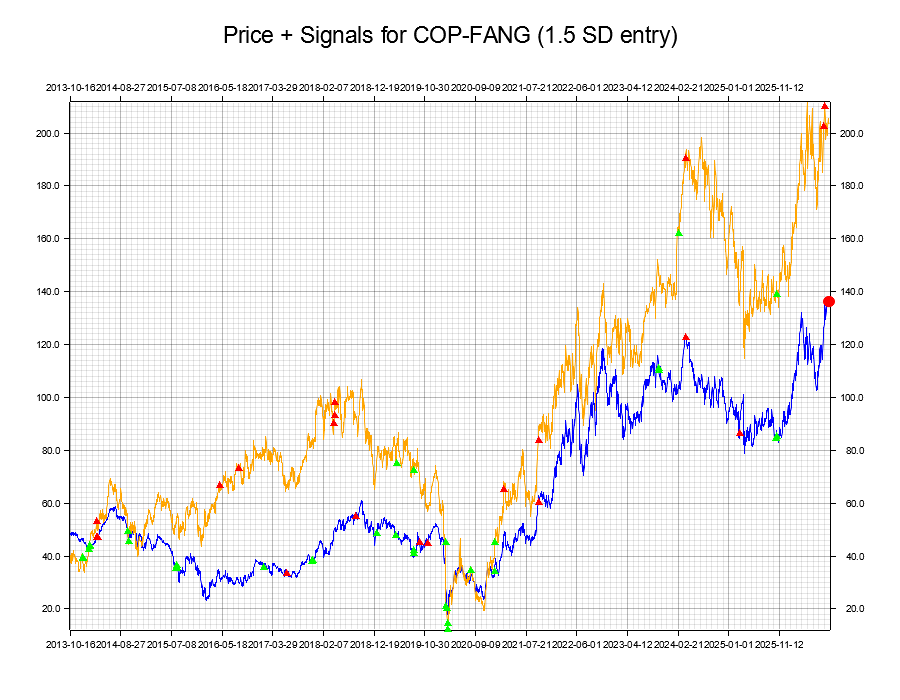
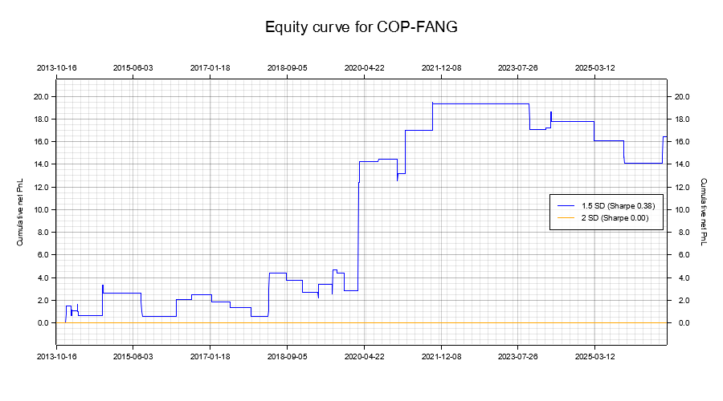
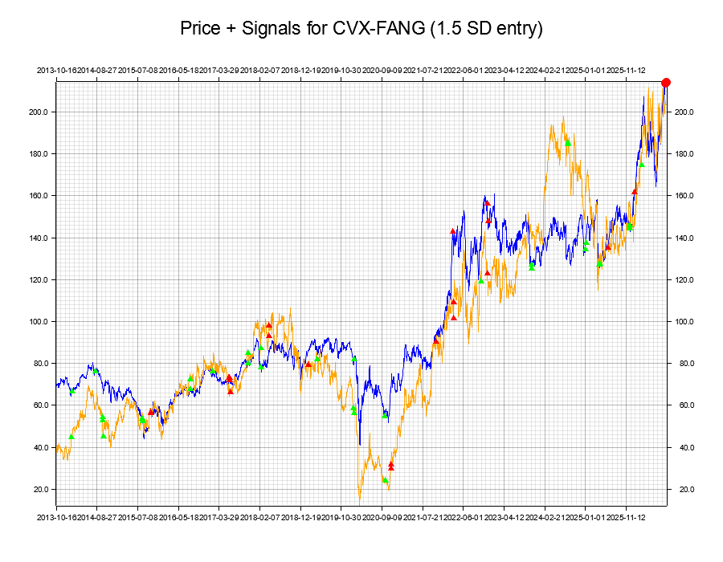
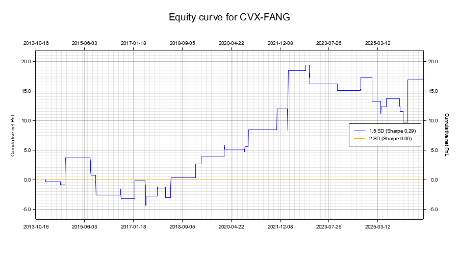

# statarbrust

A Rust statistical-arbitrage pairs-trading engine for the energy sector. Fetches historical prices, finds cointegrated pairs, generates mean-reversion trading signals, backtests them without look-ahead bias, and produces an HTML dashboard (plus an interactive Streamlit app) of the results.

## Pipeline

1. **Universe** — 15 energy tickers (`src/universe/energy_list.rs`), fetched from Yahoo Finance.
2. **Cointegration scan** — Engle-Granger two-step test (proper Augmented Dickey-Fuller with AIC lag selection, real MacKinnon (2010) critical values) on **log** prices, tested in **both regression directions** since the test's power isn't symmetric in finite samples; a pair counts as cointegrated if either direction passes (see `src/universe/cointegration_scan.rs`).
3. **Walk-forward hedge ratio & spread** — the hedge ratio is **not** fit once on the whole price history. It's refit on a trailing 252-bar (~1 trading year) window every 21 bars, on log prices (matching the direction actually tested for cointegration), and the first 252 bars of every pair ("formation period") are excluded from trading entirely (`src/model/spread.rs::walk_forward_hedge_ratio`).
4. **Half-life gate** — the Ornstein-Uhlenbeck half-life of the walk-forward spread is estimated; a pair that's cointegrated by the ADF test but shows no measurable mean reversion is skipped rather than traded (`src/model/spread.rs::half_life`).
5. **Signals** — a rolling z-score of the spread (10-day mean vs. 40-day mean, divided by the spread's own 40-day standard deviation — **1 SD = 1 standard deviation of the spread over that trailing 40-day window**), with entries at **1.5 SD** and **2.0 SD** (backtested independently) and exits at 0.5 SD.
6. **Backtest** — per-bar PnL net of transaction costs (2 bps/leg per position change), producing an equity curve, annualized volatility, a risk-free-adjusted **Sharpe** ratio, a **Sortino** ratio (downside-only), and max drawdown for every pair/threshold combination.
7. **Ranking** — all pairs are ranked best-to-trade by Sharpe ratio.
8. **Forecast** — a short ARMA(1,2)-based 5-day-ahead forecast of the same walk-forward spread, with projected trade direction.

## Output (`output/`)

- `dashboard.html` — a "Methodology & references" panel, the ranking table, and each pair's price/signal charts (both thresholds) plus its equity curve, grouped side by side.
- `backtests_energy.csv` — rank, pair, threshold, half-life, gross/net PnL, transaction cost, risk-free rate, volatility, Sharpe, Sortino, max drawdown, trade count.
- Per-pair PNGs: `<A>_<B>_{1_5sd,2sd}_{signals,prices}.png`, `<A>_<B>_equity.png`.

## Running

```bash
cargo run --release
```

Requires network access to fetch price data from Yahoo Finance. Output is written to `output/`.

## Streamlit dashboard

An interactive alternative to `output/dashboard.html`: sortable/filterable ranking table, KPI cards, CSV download, and each pair's charts grouped side by side in a collapsible row (best pair first, expanded by default for the top 3).

```bash
pip install -r dashboard/requirements.txt
streamlit run dashboard/streamlit_app.py
```

It reads directly from `output/` (run `cargo run --release` first), or use the **Regenerate data** button in the sidebar to re-run the Rust pipeline from within the app (requires `cargo` on PATH and network access).

## Results (snapshot)

Yahoo Finance data is live, so results shift run to run — this table is from a run on 2026-09-11, included for reference. Full ranking in `output/backtests_energy.csv`.

### Why this table looks very different from earlier versions of this README

Earlier snapshots of this project ranked **EOG / XOM** as the #1 pair with a Sharpe ratio of **0.607**. After fixing the look-ahead bias described below (the hedge ratio used to now be fit once on the *entire* price history, including years of data that, at any given simulated trade, hadn't happened yet), that same pair's honest, walk-forward Sharpe ratio is **-0.169** — it would have *lost* money net of costs. This is not a regression; it's the fix working as intended. A backtest that lets today's trade "see" tomorrow's prices will almost always look better than reality, and this project's numbers changing this much after removing that leak is itself evidence the leak was real and material — exactly the kind of result the statistical-arbitrage literature warns to watch for (see References below). Out of the 12 pairs that passed the cointegration screen, only **2** now show a positive Sharpe ratio at the 1.5 SD threshold. Treat that as the headline finding of this pass, not a footnote.

| Rank | Pair | Entry SD | Half-Life (bars) | Risk-Free Rate | Volatility | Sharpe | Sortino | Max Drawdown | Transaction Cost | Net PnL | Trades |
|---|---|---|---|---|---|---|---|---|---|---|---|
| 1 | COP / FANG | 1.5 | 38.9 | 4.00% | 3.2541 | 0.379 | 0.940 | 5.3602 | 0.04 | 16.40 | 54 |
| 2 | CVX / FANG | 1.5 | 29.2 | 4.00% | 4.3121 | 0.294 | 0.559 | 9.6431 | 0.04 | 16.83 | 54 |
| 3–14 | (all 2.0 SD pairs) | 2.0 | 26.5–65.5 | 4.00% | 0.0000 | 0.000 | 0.000 | 0.0000 | 0.00 | 0.00 | 0 |
| 15 | SLB / HAL | 1.5 | 54.3 | 4.00% | 0.7276 | -0.046 | -0.068 | 1.4431 | 0.03 | 0.08 | 41 |
| 16 | MPC / PSX | 1.5 | 63.5 | 4.00% | 3.5183 | -0.056 | -0.112 | 12.5428 | 0.04 | -2.03 | 48 |
| 17 | EOG / FANG | 1.5 | 26.5 | 4.00% | 2.8718 | -0.066 | -0.081 | 12.9497 | 0.03 | -1.92 | 36 |
| 18 | EOG / XOM | 1.5 | 39.9 | 4.00% | 1.8962 | -0.169 | -0.214 | 7.1771 | 0.03 | -3.61 | 41 |
| 19 | PSX / VLO | 1.5 | 35.2 | 4.00% | 1.8902 | -0.306 | -0.350 | 14.0062 | 0.04 | -6.92 | 44 |
| 20 | DVN / FANG | 1.5 | 65.5 | 4.00% | 3.8287 | -0.317 | -0.375 | 22.8250 | 0.03 | -15.10 | 39 |
| 21 | CVX / MPC | 1.5 | 28.4 | 4.00% | 4.8026 | -0.347 | -0.389 | 30.2089 | 0.04 | -20.93 | 50 |
| 22 | XOM / FANG | 1.5 | 37.2 | 4.00% | 3.3915 | -0.395 | -0.479 | 16.8653 | 0.03 | -16.72 | 43 |
| 23 | HAL / APA | 1.5 | 42.4 | 4.00% | 1.3815 | -0.424 | -0.521 | 10.5260 | 0.04 | -7.03 | 56 |
| 24 | SLB / APA | 1.5 | 42.4 | 4.00% | 1.7699 | -0.738 | -0.813 | 16.7856 | 0.05 | -16.30 | 57 |

Every 2.0 SD row shows zero trades: with the 10/40-day rolling window, the spread rarely swings past 2 SD within a bar's own trailing 40-day standard deviation, so the conservative threshold essentially never fires. That's a real (if underwhelming) finding about this parameterization, not a bug.

### Top pairs

Only two pairs cleared a positive Sharpe ratio this run — shown here honestly rather than padded out to an arbitrary "top 3."

**#1 COP / FANG** (Sharpe 0.379, Sortino 0.940, half-life 38.9 bars)




**#2 CVX / FANG** (Sharpe 0.294, Sortino 0.559, half-life 29.2 bars)




## Layout

```
src/
  data/      price fetching (Yahoo Finance)
  model/     OLS, ADF/cointegration, walk-forward spread, half-life, forecasting
  engine/    signal generation, backtesting (Sharpe, Sortino, drawdown, equity curve)
  universe/  ticker universe, correlation/cointegration scan, plotting, HTML export
dashboard/   Streamlit app that reads output/ and renders it interactively
```

## Methodology & references

Where the statistical-arbitrage literature offers more than one accepted approach, this project had to pick one. Each choice below is stated along with the alternative it passed over and why, so a reader can judge whether that trade-off suits their own use case.

- **Cointegration test: Engle-Granger, not Johansen.** Engle & Granger (1987), "Co-integration and Error Correction," *Econometrica* 55(2), gives a simple two-step test well suited to exactly two assets. Johansen (1991), "Estimation and Hypothesis Testing of Cointegration Vectors," *Econometrica* 59(6), is the more general/robust choice for baskets of three or more assets and doesn't require picking a dependent variable — but it needs an eigenvalue decomposition this codebase doesn't otherwise carry, and this project only ever trades pairs (two assets), where Engle-Granger's known weakness (asymmetric power depending on regression direction) is directly mitigated by testing both directions (Chan, *Algorithmic Trading*, 2013, ch. 5), which is what `cointegration_scan.rs` does. **Priority given to**: Engle-Granger, for tractability at N=2; Johansen is the natural next step if this project ever trades baskets.
- **Rolling windows: fixed 10/40 days, not sized to each pair's half-life.** Vidyamurthy, *Pairs Trading: Quantitative Methods and Analysis* (2004), recommends sizing the lookback used to build a spread's z-score off its own measured mean-reversion half-life, since a fast-reverting pair and a slow one don't belong under the same fixed window. This project computes half-life (see step 4 above) and uses it as a pass/fail *gate*, but keeps the 10/40-day window fixed across every pair rather than adapting it per pair. **Priority given to**: comparability — every pair's Sharpe/Sortino/drawdown numbers are directly comparable to each other because they all came from the identical signal rule; per-pair adaptive windows would be more "correct" per pair but would turn the ranking table into an apples-to-oranges comparison. Flagged here as the clearest piece of unfinished-but-known future work.
- **Universe selection: full-sample, not periodically re-formed.** Gatev, Goetzmann & Rouwenhorst (2006), "Pairs Trading: Performance of a Relative-Value Arbitrage Rule," *Review of Financial Studies* 19(3), re-select the tradeable universe every 6 months from a trailing 12-month formation window, so which pairs are even considered changes over time along with the market. This project's cointegration screen (step 2) runs once on the full available history, then the *hedge ratio* used inside that fixed set of pairs is walk-forward (step 3). **Priority given to**: this is the one place a full point-in-time reconstruction was scoped out — it would mean re-running the O(n²) cointegration scan across the whole universe at every rebalance point, a materially larger rearchitecture. The result: the hedge ratio and every simulated trade are honestly walk-forward and don't peek ahead, but *which pairs were worth considering in the first place* is still decided with the full benefit of hindsight. See the caveat this implies below.
- **Half-life**: Uhlenbeck & Ornstein (1930), "On the Theory of the Brownian Motion," *Physical Review* 36(5) — the continuous-time mean-reverting process; its discrete-time half-life estimator (regress the spread's bar-over-bar change on its own lagged level) is standard, e.g. Chan (2013) ch. 2.
- **MacKinnon critical values**: MacKinnon (2010), "Critical Values for Cointegration Tests," Queen's University Dept. of Economics Working Paper No. 1227 — response-surface coefficients transcribed from `statsmodels`' open-source implementation and cross-checked against its own printed output (see `src/model/adf.rs`).
- **Sharpe / Sortino**: Sharpe (1966/1994), "The Sharpe Ratio," *The Journal of Portfolio Management*; Sortino & Price (1994), "Performance Measurement in a Downside Risk Framework," *The Journal of Investing*. Both computed from the strategy's own bar-by-bar equity curve, annualized by √252, against the same fixed risk-free hurdle so the two are directly comparable side by side.
- **Value at Risk**: Jorion, *Value at Risk* — standard parametric one-day 95% VaR (1.645σ) used in the per-pair console summary, derived from the backtest's own realized daily P&L volatility.

## Assumptions & limitations

- **Sizing**: backtests use unit notional (1.0) per pair, so PnL/Sharpe/volatility figures are in normalized units, not dollars — useful for ranking pairs against each other, not as a real P&L.
- **Volatility lookback (results table)**: the `Volatility`, `Sharpe`, and `Sortino` columns are computed from bar-over-bar equity-curve changes over the pair's entire *post-formation* trading history (not a rolling window), then annualized by √252. This is a different lookback from the signal's own volatility estimate (the z-score's rolling 40-day spread standard deviation) — don't conflate the two.
- **Costs**: 2 bps per leg charged on every position change (entry, exit, or a direct long↔short flip); no market impact or partial fills modeled.
- **Risk-free rate**: fixed at 4%/year (`RISK_FREE_RATE_ANNUAL` in `src/engine/backtest.rs`), applied per-bar against unit-notional returns — an approximation, not a real historical T-bill series.
- **Universe selection uses the full sample** (see Methodology above) even though the hedge ratio used to trade each selected pair does not — a pair that was only cointegrated because of data in what would have been "the future" at an earlier point in the sample could still have made it into the tradeable set.
- **Not investment advice**: this is a research/education tool; do not trade on its output without independent validation.
